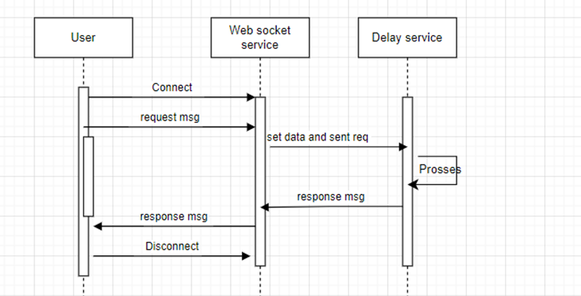
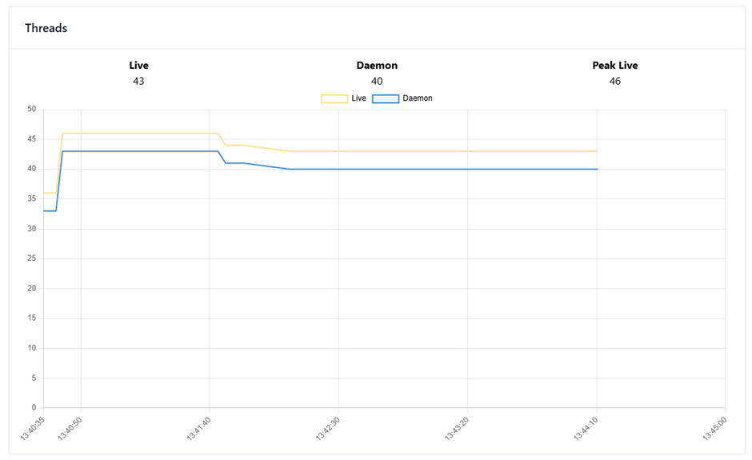
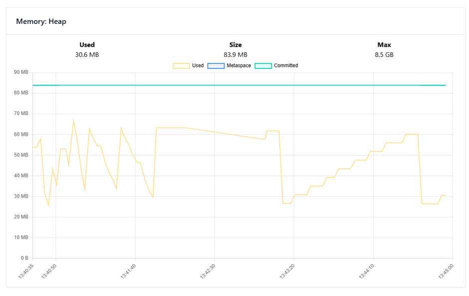
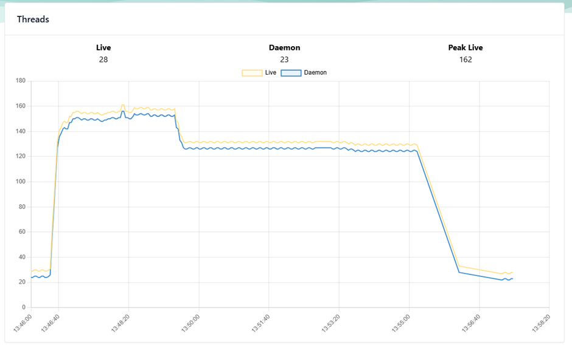
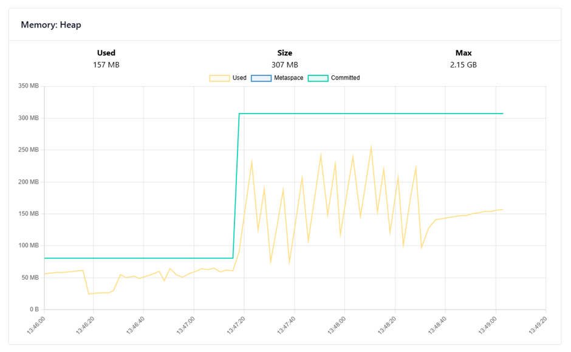

# Delay-service-reactive Controller
swagger http://localhost:8081/swagger-ui/index.html#/

# web-socket-reactive

# web-socket-reactive VS web-socket-blocking
Scenario:
1. Clients open a WebSocket connection and send messages to the server.
2. In response, the server sets a data and sends a request to the Delay-Service.
3. Once the Delay-Service responds, the server sends a response to the client.

By using the `web-socket-reactive` implementation,
the server can handle the same connections and messages with a less resources (Threads & Memory)
than the `web-socket-blocking` implementation.

    int totalConnections = 1000;
    int totalMessagesForEachConnection = 50;
    Duration delayBetweenMessagesElementsDuration = Duration.ofMillis(200);
    Duration delayBetweenOpenConnectionsDuration = Duration.ofMillis(100);
    Delay-service: private static final Duration DELAY_DURATION = Duration.ofMillis(200);
Total Test duration:
((200 ms) * 50) + (1000 * (100 ms)) =
~110 seconds

# Benchmark results:
    
## web-socket-reactive:

## web-socket-blocking:

